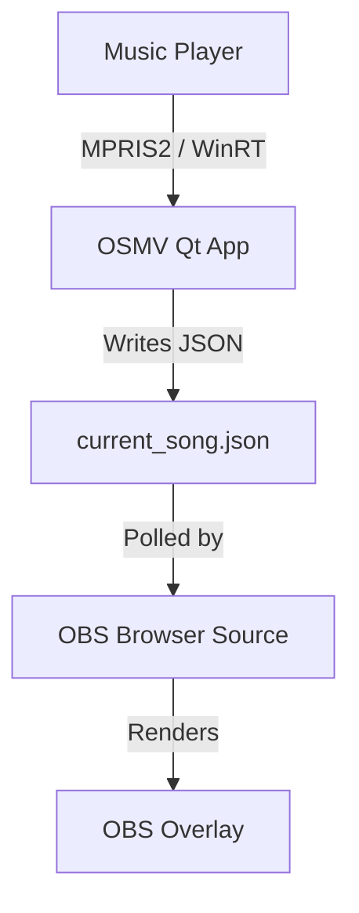

# OBS Stream Music Viewer (OSMV)


Welcome to the **StreamMusicViewer** organization! This is the flagship **"Now Playing"** widget for OBS. Built in **C++ with Qt 6**, it's designed to be elegant, lightweight, and high-performance.

## Features

- **Real-time updates** — Detects currently playing music every second
- **Album artwork** — Displays full-resolution album covers
- **Dynamic color** — Widget background matches the album cover palette
- **Audio visualizer** — Animated bars in OBS (beta)
- **Discord Rich Presence** — Shows what you're listening to on Discord
- **Background operation** — Minimize to system tray
- **Multi-app support** — Spotify, Apple Music, Firefox, Chrome, VLC, and more

## How It Works



---

## Quick Start

### Windows

1. Go to the **[Releases](https://github.com/StreamMusicViewer/OSMV/releases)** page and download the latest `.zip`.
2. Extract and place `osmv.exe`, `index.html`, and `style.css` in a folder.
3. Double-click `osmv.exe`.
4. Configure OBS (see below).

### Linux

**Install dependencies:**
```bash
sudo pacman -S qt6-base playerctl   # Arch / Manjaro
# or
sudo apt install qt6-base-dev playerctl   # Ubuntu 24.04+
```

1. Go to the **[Releases](https://github.com/StreamMusicViewer/OSMV/releases)** page and download the latest Linux binary.
2. Place `osmv`, `index.html`, and `style.css` in the same folder.
3. `chmod +x osmv && ./osmv` — an icon appears in your system tray.
4. Configure OBS (see below).

---

## Configure OBS

1. In OBS, add a new **Browser** source.
2. Check **"Local file"**.
3. Browse and select `index.html` from the folder containing the app.
4. Set dimensions: **Width: 500**, **Height: 140**.
5. Click OK.

*As long as the application is running, your OBS widget updates automatically.*

---

## Our Repositories

| Repository | Description |
| :--- | :--- |
| **[OSMV (Full)](https://github.com/StreamMusicViewer/OSMV)** | The complete experience with album art, color adaptation, Discord RP, and visualizer. |
| **[OSMV Lite](https://github.com/StreamMusicViewer/OSMV-lite)** | The minimal version for maximum broadcast performance. |

---

## Links & Creator
* **Creator:** [@Ulyxx3](https://github.com/Ulyxx3)
* **License:** [MIT](https://github.com/StreamMusicViewer/OSMV/blob/main/LICENSE)
* **Troubleshooting:** [Troubleshooting Guide](https://github.com/StreamMusicViewer/OSMV/blob/main/TROUBLESHOOTING.md)

---
*Built for streamers who care about every detail of their broadcast.*
